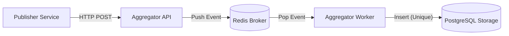

# Distributed Pub-Sub Log Aggregator
Proyek ini adalah implementasi sistem **Log Aggregator Terdistribusi** menggunakan arsitektur **Publish-Subscribe**. Sistem dirancang untuk menangani konkurensi tinggi, menjamin *idempotency* (mencegah duplikasi data), dan memiliki toleransi terhadap kegagalan (*fault tolerance*).

**Mata Kuliah:** Sistem Terdistribusi  
**Teknologi:** Python (FastAPI), Redis, PostgreSQL, Docker Compose.

---

## 1. Arsitektur Sistem


## Komponen
1. Publisher:
    - Mensimulasikan ribuan event logs.
    - Memiliki logika *retry* dan *backoff* jika Aggregator belum siap.
    - Sengaja mengirimkan 30% data duplikat untuk menguji ketahanan sistem.

2. Aggregator:
    -  API Layer: Menerima request HTTP dan meneruskannya ke antrean (*non-blocking*).
    - Worker Layer: Memproses antrean Redis secara asinkron dan menyimpan ke Database.

3. Broker:
    - Menggunakan Redis sebagai *Message Queue* sementara.

4. Storage:
    - Menggunakan PostgreSQL.
    - Menjamin konsistensi data menggunakan *Unique Constraint* (topic, event_id) untuk deduplikasi.

## 2. Cara Menjalankan (*Build & Run*)
Pastikan **Docker** dan **Docker Compose** sudah terinstal.

### Menjalankan Sistem
Jalankan perintah berikut di terminal root proyek:
```
docker-compose up --build -d
```

- Tunggu hingga semua service berstatus **healthy** atau **started**.
- Publisher akan otomatis mulai mengirim 1000 event setelah Aggregator siap.

### Menghentikan Sistem
```
docker-compose down
```

### Reset Total
Jika ingin mengulang pengujian dari database kosong:
```
docker-compose down -v
docker-compose up --build
```

---

## 3. Dokumentasi API
Layanan Aggregator berjalan di http://localhost:8080/docs.

### 1. Publish Event
- Endpoint: POST /publish
- Deskripsi: Menerima event log baru.
- Payload JSON:

    ```
    {
        "topic": "orders",
        "event_id": "unique-uuid-123",
        "timestamp": "2025-12-08T10:00:00Z",
        "source": "app-service",
        "payload": { "amount": 500 }
    }
    ```
- Response: 200 OK

### 2. Get Events
- Endpoint: GET /events
- Query Params:
    - topic (optional): Filter berdasarkan topik.
    - limit (optional): Jumlah data (default 100).
- Contoh: GET /events?topic=orders&limit=5

### 3. Get Statistics
- Endpoint: GET /stats
- Deskripsi: Melihat metrik performa dan deduplikasi.
- Response:
    ```
    {
        "uptime_stats": {
            "total_received_api": 1000,
            "duplicates_dropped_consumer": 300
        },
        "database_stats": {
            "unique_events_stored": 700
        }
    }
    ```

---

## 4. Cara Pengujian (Testing)
Proyek ini dilengkapi dengan 12 Integration Tests menggunakan **pytest** untuk memvalidasi logika sistem.

### Prasyarat Testing
Pastikan library testing terinstal di environment lokal (Laptop):
```
pip install pytest pytest-asyncio httpx asyncpg
```

### Langkah-langkah Test
1. Pastikan Docker Compose sedang berjalan
2. Jalankan perintah pytest:
    ```
    pytest -v tests/
    ```

---

## 5. Fitur Teknis Utama
1. **Idempotent Consumer**: Menggunakan strategi **INSERT ... ON CONFLICT DO NOTHING** pada level database. Ini menjamin data tidak akan duplikat meskipun message broker mengirim pesan yang sama berkali-kali (*At-Least-Once Delivery*).
2. **Concurrency Control**: Menggunakan level isolasi database *Read Committed* dikombinasikan dengan *Unique Constraints* untuk menangani ribuan *concurrent writes* tanpa anomali data.
3. **Fault Tolerance**: Publisher memiliki mekanisme *wait-and-retry*. Jika Aggregator mati atau belum siap, Publisher akan menunggu dan mencoba lagi secara otomatis.
4. **Persistensi Data**: Menggunakan Docker Volumes, sehingga data log aman dan tidak hilang meskipun kontainer dimatikan atau di-restart.

---

## 6. Demo Video
```
https://youtu.be/udPvHlAzZlE
```